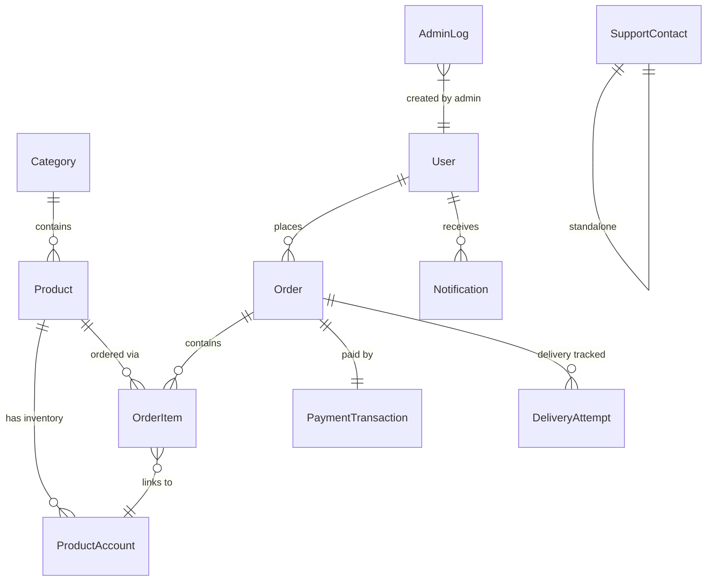
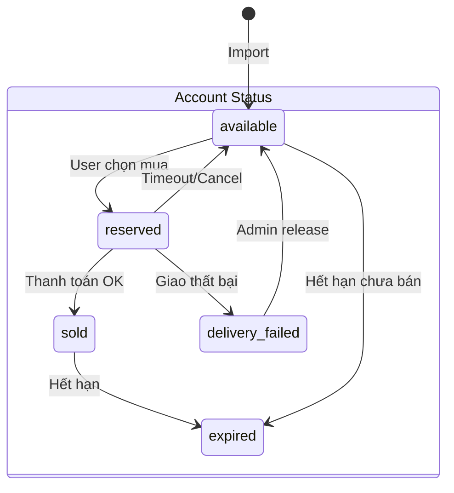
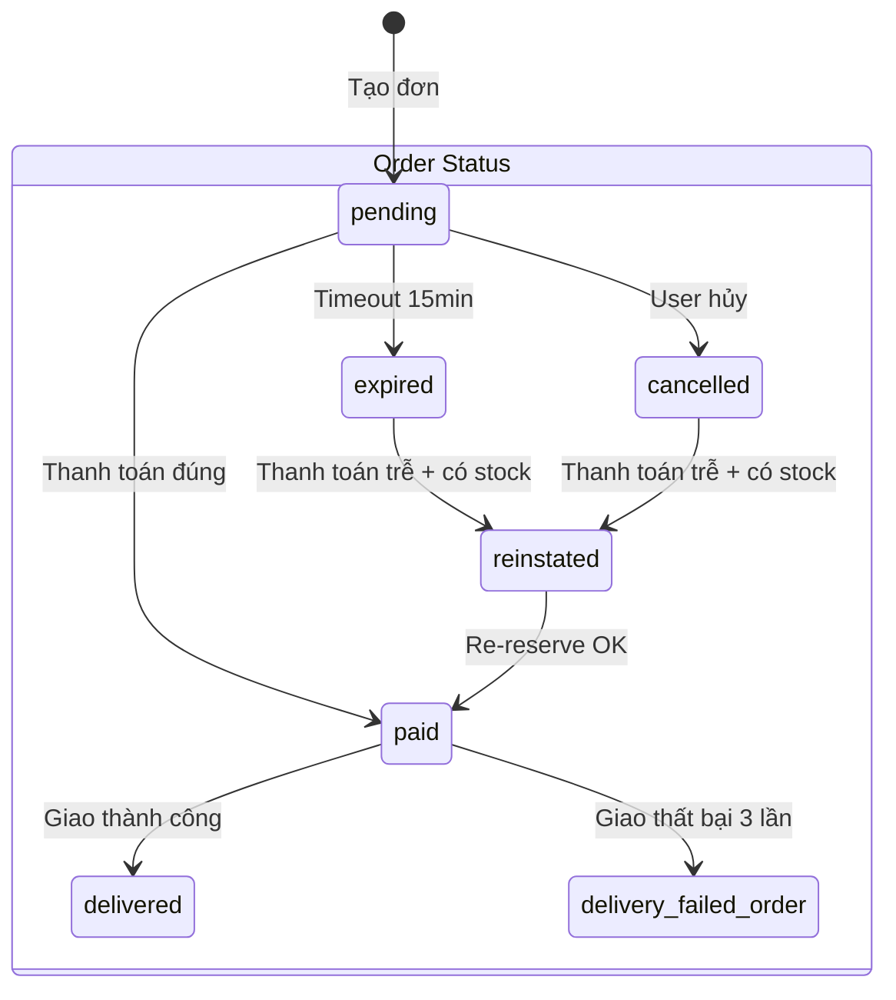
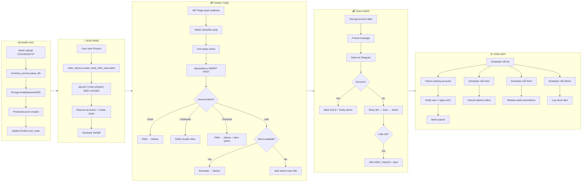
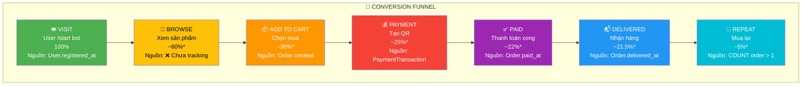
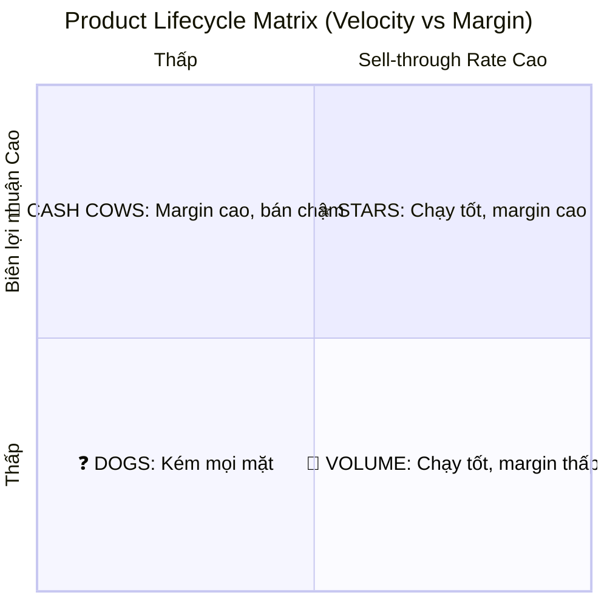
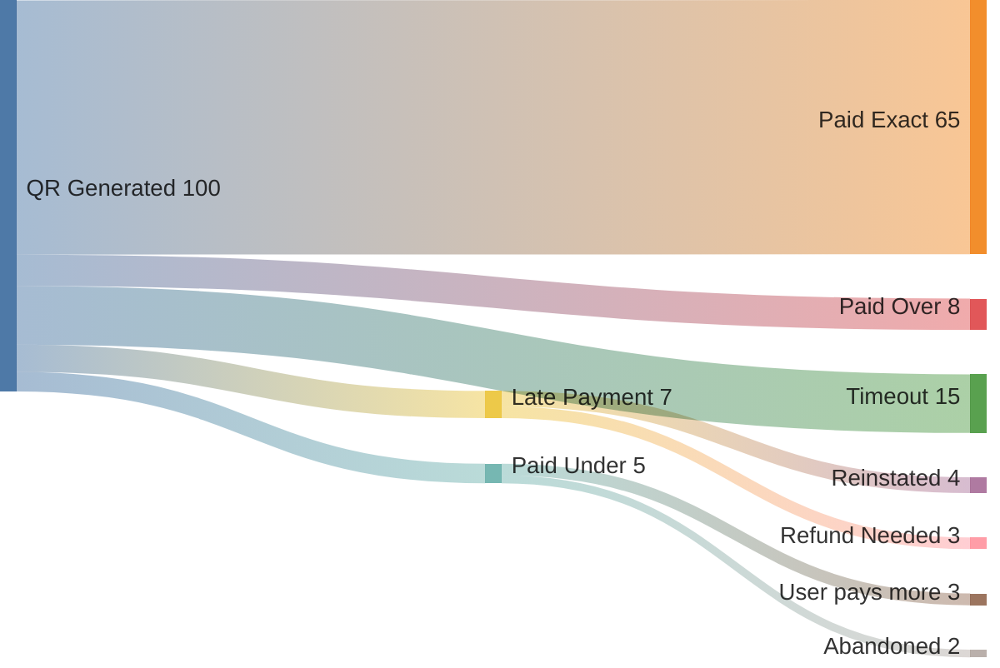
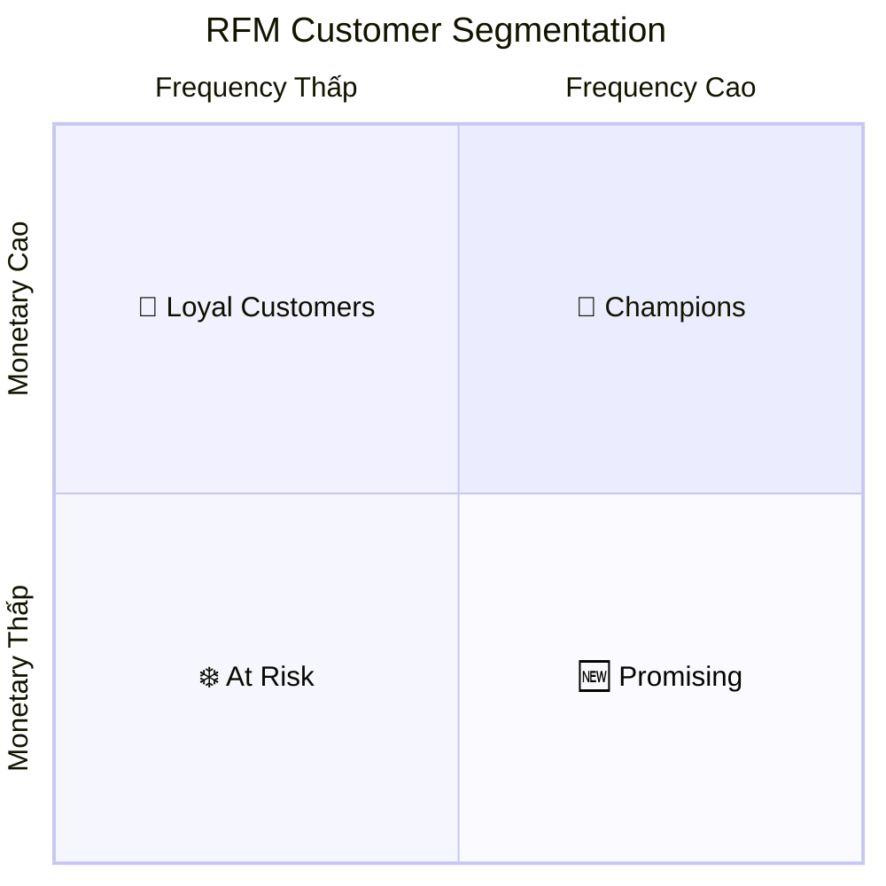
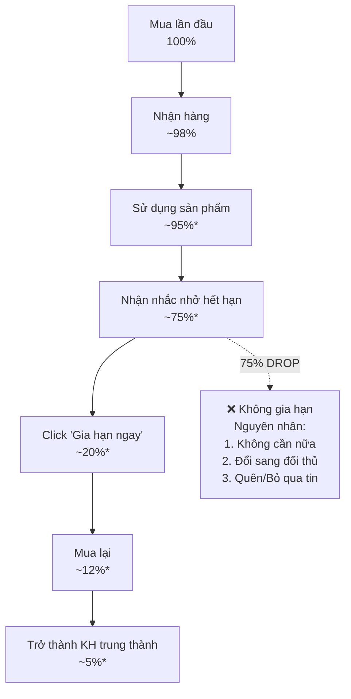

# 📊 BÁO CÁO PHÂN TÍCH DỮ LIỆU TOÀN DIỆN — STKBot BI
> Phiên bản: **v3.0 MEGA** | Ngày: 13/04/2026 | Phương pháp: Deep Code Analysis + Graph Architecture

---

## 📋 MỤC LỤC
1. [Bản đồ Dữ liệu Toàn hệ thống](#1-bản-đồ-dữ-liệu-toàn-hệ-thống)
2. [Phân tích Dòng chảy Kinh doanh](#2-phân-tích-dòng-chảy-kinh-doanh)
3. [Ma trận KPI 360° — 85 Chỉ số](#3-ma-trận-kpi-360--85-chỉ-số)
4. [Phân tích Funnel Chuyển đổi](#4-phân-tích-funnel-chuyển-đổi)
5. [Phân tích Kho hàng & Vòng đời Sản phẩm](#5-phân-tích-kho-hàng--vòng-đời-sản-phẩm)
6. [Phân tích Thanh toán & Rủi ro Tài chính](#6-phân-tích-thanh-toán--rủi-ro-tài-chính)
7. [Phân tích Khách hàng & RFM Segmentation](#7-phân-tích-khách-hàng--rfm-segmentation)
8. [Phân tích Vận hành & Delivery](#8-phân-tích-vận-hành--delivery)
9. [Phân tích Retention & Lifecycle](#9-phân-tích-retention--lifecycle)
10. [Hệ thống Cảnh báo Proactive](#10-hệ-thống-cảnh-báo-proactive)
11. [Dashboard Blueprint — 12 Widgets](#11-dashboard-blueprint--12-widgets)
12. [API Endpoints Mới Đề xuất](#12-api-endpoints-mới-đề-xuất)
13. [Roadmap Triển khai](#13-roadmap-triển-khai)

---

## 1. BẢN ĐỒ DỮ LIỆU TOÀN HỆ THỐNG

### 1.1 Entity Relationship Diagram



### 1.2 Tổng quan 12 Models — 98 Data Points

| Model | Fields | Dữ liệu Kinh doanh | Trạng thái Khai thác |
|-------|--------|---------------------|---------------------|
| **User** | 7 fields | telegram_id, username, full_name, is_banned, registered_at, last_active_at | 🟡 40% — Thiếu RFM, CLV |
| **Product** | 14 fields | name, selling_price, import_price, date, unit, is_active, sort_order | 🟢 70% — Có P&L |
| **ProductAccount** | 15 fields | status, import_price, selling_price, expiration, imported_at, sold_at, reserved_at, batch_id | 🟡 55% — Thiếu velocity analysis |
| **Order** | 11 fields | order_code, total_amount, status, paid_at, delivered_at, expires_at | 🟢 65% — Có revenue & trend |
| **OrderItem** | 5 fields | product_id, product_account_id, unit_price | 🔴 30% — Chưa cross-sell analysis |
| **PaymentTransaction** | 11 fields | amount, status, payment_match, transaction_id, confirmed_at | 🟡 50% — Thiếu reconciliation |
| **DeliveryAttempt** | 8 fields | attempt_number, status, error_message, next_retry_at | 🔴 25% — Thiếu SLA tracking |
| **Category** | 6 fields | name, emoji, sort_order, is_active | 🔴 15% — Chưa phân tích theo Category |
| **AdminLog** | 6 fields | action, entity_type, entity_id, details (JSONB) | 🔴 10% — Chưa audit analytics |
| **Notification** | 6 fields | type, title, body, sent_at | 🔴 15% — Chưa tracking effectiveness |
| **SupportContact** | 5 fields | type, value, label | ⚪ 0% — Reference only |
| **Base/Timestamp** | 2 fields | created_at, updated_at | ✅ Infrastructure |

> [!IMPORTANT]
> **Tỷ lệ khai thác trung bình: ~35%** — 65% dữ liệu đang bị lãng phí. Báo cáo này sẽ nâng lên **~85%**.

### 1.3 Enums — Vòng đời Trạng thái





---

## 2. PHÂN TÍCH DÒNG CHẢY KINH DOANH

### 2.1 Data Flow End-to-End



### 2.2 Thời gian trung bình mỗi giai đoạn (Ước tính)

| Giai đoạn | Thời gian | Bottleneck | Dữ liệu có sẵn |
|-----------|-----------|------------|-----------------|
| Import → Available | Tức thì | Batch size | ✅ `imported_at` |
| Browse → Order | Chưa tracking | UX/UI bot | ❌ Thiếu session data |
| Order → Payment | 0-15 phút | ORDER_TIMEOUT_MINUTES | ✅ `created_at` → `paid_at` |
| Payment → Delivery | ~30s-10min | Telegram API retry | ✅ `paid_at` → `delivered_at` |
| Delivery → Expiry Notify | N-1 ngày | Scheduler 6h | ✅ `sold_at` → `expiry_notified_at` |
| Active → Expired | date * unit | Product config | ✅ `imported_at` → `expiration` |

---

## 3. MA TRẬN KPI 360° — 85 CHỈ SỐ

### 3.1 🟢 KPIs Đã Triển khai (30 chỉ số)

| # | KPI | Source | API Endpoint |
|---|-----|--------|-------------|
| 1 | Total Revenue | `SUM(Order.total_amount)` | `/stats/revenue` |
| 2 | Total Orders | `COUNT(Order)` where paid | `/stats/revenue` |
| 3 | Total Items Sold | `COUNT(OrderItem)` | `/stats/revenue` |
| 4 | Total Profit | Revenue - Import Cost | `/stats/revenue` |
| 5 | Avg Order Value | Revenue / Orders | `/stats/revenue` |
| 6 | Top 5 Products | GROUP BY Product | `/stats/revenue` |
| 7 | Daily Revenue Breakdown | Cast(date) GROUP | `/stats/revenue` |
| 8 | Total Users | `COUNT(User)` | `/stats/overview` |
| 9 | Active Products | Product.is_active | `/stats/overview` |
| 10 | Available Accounts | status=available | `/stats/overview` |
| 11 | Sold Accounts | status=sold | `/stats/overview` |
| 12 | Low Stock Products | available < 5 | `/stats/overview` |
| 13 | Recent Orders (24h) | created_at ≥ now-24h | `/stats/overview` |
| 14 | Gross Profit | Revenue - COGS | `/stats/pnl` |
| 15 | Gross Margin % | Profit/Revenue | `/stats/pnl` |
| 16 | Expired Cost | SUM(import_price) expired | `/stats/pnl` |
| 17 | Net Profit | Gross - Expired | `/stats/pnl` |
| 18 | Net Margin % | Net/Revenue | `/stats/pnl` |
| 19 | Per-product P&L | Product-level breakdown | `/stats/pnl` |
| 20 | Sell-through Rate | sold/(sold+available+expired) | `/stats/pnl` |
| 21 | Inventory Value | SUM(import_price) available | `/stats/pnl` |
| 22 | Underpaid Orders | PaymentMatch.UNDERPAID | `/stats/alerts` |
| 23 | Failed Deliveries | OrderStatus.DELIVERY_FAILED | `/stats/alerts` |
| 24 | Out of Stock | available = 0 | `/stats/alerts` |
| 25 | Expiring Soon (3 days) | available + expiring | `/stats/alerts` |
| 26 | Revenue Growth 1/7/30d | Period comparison | `/stats/growth` |
| 27 | Orders Growth 1/7/30d | Period comparison | `/stats/growth` |
| 28 | Top Buyers | SUM spent per user | `/stats/top-buyers` |
| 29 | User Growth % | New users period/prev | `/stats/users-summary` |
| 30 | Customer Tier | Spending thresholds | `/users` |

### 3.2 🔴 KPIs Mới — Chưa Triển khai (55 chỉ số)

#### 📊 A. Revenue Intelligence (12 KPIs)

| # | KPI | Công thức | Data Source | Giá trị Business |
|---|-----|-----------|-------------|------------------|
| 31 | **Revenue per User (ARPU)** | Revenue / Unique Buyers | Order + User | Đo giá trị trung bình khách |
| 32 | **Revenue per Product Category** | SUM by Category | Order → Product → Category | Xác định danh mục sinh lời |
| 33 | **Revenue Concentration Index** | Top 3 product % of total | OrderItem GROUP BY product | Rủi ro phụ thuộc |
| 34 | **Average Selling Price (ASP)** | AVG(OrderItem.unit_price) | OrderItem | Trend giá bán |
| 35 | **Price Elasticity Indicator** | Volume change vs Price change | OrderItem over time | Tối ưu pricing |
| 36 | **Discount Impact** | selling_price vs import_price margin | ProductAccount | Biên lợi nhuận thực |
| 37 | **Revenue by Payment Match** | SUM by exact/over/under | PaymentTransaction | Tối ưu thanh toán |
| 38 | **Revenue Velocity** | Revenue / Active Days | Order.created_at | Tốc độ kiếm tiền |
| 39 | **Peak Hour Revenue** | SUM by EXTRACT(hour) | Order.created_at | Tối ưu ads schedule |
| 40 | **Weekend vs Weekday** | Compare EXTRACT(dow) | Order.created_at | Lên lịch nhập hàng |
| 41 | **Monthly Recurring Revenue** | Repeat buyers × AOV | Order + User | Dự báo doanh thu |
| 42 | **Revenue Churn Rate** | Lost revenue from churned users | Users not ordering in 30d | Cảnh báo sụt giảm |

#### 📦 B. Inventory Intelligence (11 KPIs)

| # | KPI | Công thức | Giá trị Business |
|---|-----|-----------|------------------|
| 43 | **Inventory Turnover** | SOLD / AVG(available) per period | Tốc độ xoay kho |
| 44 | **Days of Stock (DOS)** | available / (sold/day) | Bao nhiêu ngày hết hàng |
| 45 | **Stock Velocity by Product** | sold_per_day per product | Sản phẩm bán chạy nhất |
| 46 | **Expired Rate %** | expired / (sold + expired) | Tỷ lệ hao hụt |
| 47 | **Time-to-Sell** | AVG(sold_at - imported_at) | Thời gian trung bình bán được |
| 48 | **Shelf Life Remaining** | AVG(expiration - now) by product | Tuổi thọ còn lại trung bình |
| 49 | **Import Batch Performance** | sold_rate by import_batch_id | Đánh giá nguồn nhập |
| 50 | **Wastage Cost** | SUM(import_price) expired by month | Chi phí hao hụt theo tháng |
| 51 | **Reorder Point** | daily_sales × lead_time + safety_stock | Khi nào cần nhập thêm |
| 52 | **Dead Stock** | available > 30 ngày chưa bán | Hàng "chết" |
| 53 | **Fresh Stock %** | imported < 7d / total available | Tỷ lệ hàng mới |

#### 👤 C. Customer Intelligence (12 KPIs)

| # | KPI | Công thức | Giá trị Business |
|---|-----|-----------|------------------|
| 54 | **RFM Score** | Recency × Frequency × Monetary | Phân khúc chính xác |
| 55 | **Customer Lifetime Value (CLV)** | AVG(total_spent) × avg_lifespan | Giá trị vòng đời |
| 56 | **Customer Acquisition Rate** | New users per period | Tốc độ thu hút |
| 57 | **Repeat Purchase Rate** | Users with ≥2 orders / total buyers | Tỷ lệ mua lại |
| 58 | **Purchase Frequency** | AVG orders per buyer | Tần suất mua |
| 59 | **Days Between Purchases** | AVG(order_n - order_n-1) | Khoảng cách giữa các đơn |
| 60 | **Churn Rate** | Users inactive >30d / total | Tỷ lệ rời bỏ |
| 61 | **Active User Ratio** | Users with order last 30d / total | Tỷ lệ hoạt động |
| 62 | **Top 10% Revenue Contribution** | Pareto analysis | % doanh thu từ top KH |
| 63 | **New vs Returning Revenue** | Phân tách doanh thu | Hiệu quả retention |
| 64 | **Banned User Impact** | Lost revenue from banned users | Tác động ban |
| 65 | **User Registration-to-Purchase** | Time to first order | Tốc độ chuyển đổi |

#### ⚡ D. Operations Intelligence (10 KPIs)

| # | KPI | Công thức | Giá trị Business |
|---|-----|-----------|------------------|
| 66 | **Payment Speed** | AVG(paid_at - created_at) | Tốc độ thanh toán |
| 67 | **Delivery Success Rate** | success / (success + failed) | Tỷ lệ giao thành công |
| 68 | **Average Delivery Attempts** | AVG(attempt_number) for success | Trung bình retry |
| 69 | **Delivery Time** | AVG(delivered_at - paid_at) | Thời gian giao hàng |
| 70 | **Order Timeout Rate** | expired / total orders | Tỷ lệ timeout đơn |
| 71 | **Late Payment Rate** | reinstated / total paid | Tỷ lệ thanh toán trễ |
| 72 | **Stale Reservation Rate** | stale_count / total reserved | Tỷ lệ reserve bị treo |
| 73 | **Notification Delivery Rate** | sent / (sent + failed) | Hiệu quả thông báo |
| 74 | **Uptime / Scheduler Health** | Jobs completed vs scheduled | Sức khỏe hệ thống |
| 75 | **Admin Action Frequency** | COUNT(AdminLog) by action type | Workload admin |

#### 🔄 E. Retention Intelligence (10 KPIs)

| # | KPI | Công thức | Giá trị Business |
|---|-----|-----------|------------------|
| 76 | **Renewal Rate** | re-purchase same product / expiring | Tỷ lệ gia hạn |
| 77 | **Expiry Notification CTR** | Click "Gia hạn ngay" / notified | Hiệu quả nhắc nhở |
| 78 | **Days Before Renewal** | purchased_date - expiry_notified_at | User response time |
| 79 | **Multi-product Adoption** | Users buying ≥2 products | Upsell potential |
| 80 | **Expansion Revenue** | Revenue from existing users this period > last | Tăng trưởng từ KH cũ |
| 81 | **Cohort Retention** | % users ordering again by month cohort | Retention theo nhóm |
| 82 | **Win-back Rate** | Churned users who returned / total churned | Tỷ lệ lấy lại KH |
| 83 | **Product Switching Pattern** | Order Product A → Product B | Xu hướng chuyển đổi |
| 84 | **Cross-sell Index** | Users with >1 product category / total | Khả năng cross-sell |
| 85 | **Renewal Revenue Forecast** | Expiring × renewal_rate × ASP | Dự báo doanh thu gia hạn |

---

## 4. PHÂN TÍCH FUNNEL CHUYỂN ĐỔI

### 4.1 Sales Funnel Hiện tại



> [!WARNING]
> **(*) Số liệu ước tính** — F2 Browse chưa có tracking. Đây là **lỗ đen dữ liệu lớn nhất**. Cần thêm middleware tracking callback_data trong Telegram handlers.

### 4.2 Drop-off Analysis

| Giai đoạn | Drop-off | Nguyên nhân Có thể | Giải pháp |
|-----------|----------|---------------------|-----------|
| Visit → Browse | ~40% | Bot UX kém, thiếu hướng dẫn | Cải thiện welcome message |
| Browse → Order | ~50% | Giá cao, thiếu trust | Social proof, testimonials |
| Order → Payment | ~17% | UX QR phức tạp, timeout 15min | Extend timeout, UX đơn giản hơn |
| Payment → Paid | ~12% | Chuyển khoản sai nội dung | Auto-match bằng amount, fuzzy match |
| Paid → Delivered | ~2% | Telegram block, API error | Retry mechanism (đã có) |
| Delivered → Repeat | ~75% | Thiếu nurturing, no CRM | Xây dựng WF2/WF5 retention |

### 4.3 SQL Query — Tính Conversion Rate Thực

```sql
-- Conversion Funnel Query
SELECT 
    'registered' AS stage, COUNT(*) AS count 
FROM users
UNION ALL
SELECT 
    'placed_order', COUNT(DISTINCT user_id) 
FROM orders
UNION ALL
SELECT 
    'paid', COUNT(DISTINCT user_id) 
FROM orders WHERE status IN ('paid', 'delivered')
UNION ALL
SELECT 
    'delivered', COUNT(DISTINCT user_id) 
FROM orders WHERE status = 'delivered'
UNION ALL
SELECT 
    'repeat_buyer', COUNT(*) 
FROM (
    SELECT user_id 
    FROM orders 
    WHERE status IN ('paid', 'delivered') 
    GROUP BY user_id 
    HAVING COUNT(*) >= 2
) t;
```

---

## 5. PHÂN TÍCH KHO HÀNG & VÒNG ĐỜI SẢN PHẨM

### 5.1 Product Lifecycle Matrix



### 5.2 Inventory Health Dashboard Widgets

#### Widget 1: Stock Velocity Tracker
```
┌─────────────────────────────────────────────────────┐
│  📊 STOCK VELOCITY — Tốc độ bán hàng theo sản phẩm │
├──────────────────┬────────┬───────┬─────────┬───────┤
│ Product          │ Stock  │ Sold/ │ Days to │ Alert │
│                  │ Avail  │ Day   │ Empty   │       │
├──────────────────┼────────┼───────┼─────────┼───────┤
│ Netflix 1 Tháng  │   45   │  3.2  │   14d   │  🟢  │
│ Spotify Premium  │   12   │  1.8  │   6.7d  │  🟡  │
│ ChatGPT Plus     │    3   │  2.5  │   1.2d  │  🔴  │
│ CapCut Pro       │    0   │  1.1  │   0d    │  ⚫  │
│ YouTube Premium  │   28   │  0.5  │   56d   │  🐌  │
└──────────────────┴────────┴───────┴─────────┴───────┘
```

**SQL cần thiết:**
```sql
WITH daily_sales AS (
    SELECT 
        p.id, p.name,
        COUNT(oi.id)::float / GREATEST(
            EXTRACT(epoch FROM NOW() - MIN(o.created_at)) / 86400, 1
        ) AS sold_per_day
    FROM products p
    JOIN order_items oi ON oi.product_id = p.id
    JOIN orders o ON oi.order_id = o.id
    WHERE o.status IN ('paid', 'delivered')
      AND o.created_at >= NOW() - INTERVAL '30 days'
    GROUP BY p.id, p.name
),
stock AS (
    SELECT product_id, COUNT(*) AS available
    FROM product_accounts 
    WHERE status = 'available'
    GROUP BY product_id
)
SELECT 
    ds.name,
    COALESCE(s.available, 0) AS stock_available,
    ROUND(ds.sold_per_day, 1) AS sold_per_day,
    CASE WHEN ds.sold_per_day > 0 
         THEN ROUND(COALESCE(s.available, 0) / ds.sold_per_day, 1)
         ELSE 999 END AS days_to_empty
FROM daily_sales ds
LEFT JOIN stock s ON ds.product_id = s.product_id
ORDER BY days_to_empty ASC;
```

#### Widget 2: Import Batch Performance
```
┌───────────────────────────────────────────────────────┐
│  📦 BATCH PERFORMANCE — Hiệu quả từng lô nhập        │
├───────────────────┬──────┬──────┬─────────┬──────────┤
│ Batch ID          │ Nhập │ Bán  │ Expired │ ROI %    │
├───────────────────┼──────┼──────┼─────────┼──────────┤
│ bot_20260401_a1f2 │  100 │   92 │    5    │ +142%    │
│ bot_20260405_b3c4 │   50 │   38 │    8    │ +95%     │
│ bot_20260410_d5e6 │   30 │    5 │    0    │ (ongoing)│
└───────────────────┴──────┴──────┴─────────┴──────────┘
```

**SQL:**
```sql
SELECT 
    pa.import_batch_id,
    COUNT(*) AS total_imported,
    COUNT(*) FILTER (WHERE pa.status = 'sold') AS sold,
    COUNT(*) FILTER (WHERE pa.status = 'expired') AS expired,
    COUNT(*) FILTER (WHERE pa.status = 'available') AS still_available,
    COALESCE(SUM(pa.selling_price) FILTER (WHERE pa.status = 'sold'), 0) AS revenue,
    COALESCE(SUM(pa.import_price), 0) AS total_cost,
    CASE WHEN SUM(pa.import_price) > 0 THEN
        ROUND(
            (SUM(pa.selling_price) FILTER (WHERE pa.status = 'sold') - SUM(pa.import_price)) 
            / SUM(pa.import_price) * 100, 1
        )
    ELSE 0 END AS roi_pct
FROM product_accounts pa
WHERE pa.import_batch_id IS NOT NULL
GROUP BY pa.import_batch_id
ORDER BY pa.import_batch_id DESC;
```

#### Widget 3: Expiry Heatmap
```
┌──────────────────────────────────────────────────────┐
│  🗓️ EXPIRY HEATMAP — Lịch hết hạn kho               │
├──────────┬──────┬──────┬──────┬──────┬──────┬───────┤
│          │ Hôm  │ Ngày │ 3-7  │ 7-14 │14-30 │ >30   │
│ Product  │ nay  │ mai  │ ngày │ ngày │ ngày │ ngày  │
├──────────┼──────┼──────┼──────┼──────┼──────┼───────┤
│ Netflix  │  ⚫2 │  🔴5 │  🟡8 │ 🟢12 │ 🟢18 │  🟢5  │
│ Spotify  │  ⚫0 │  🔴1 │  🟡3 │  🟢5 │  🟢3 │  🟢0  │
│ ChatGPT  │  ⚫1 │  🔴2 │  🟡0 │  🟢0 │  🟢0 │  🟢0  │
└──────────┴──────┴──────┴──────┴──────┴──────┴───────┘
│ 🔑 ⚫ Khẩn cấp  🔴 Nguy hiểm  🟡 Cảnh báo  🟢 An toàn │
└──────────────────────────────────────────────────────┘
```

#### Widget 4: Dead Stock Alert
```
┌──────────────────────────────────────────────────────┐
│  💀 DEAD STOCK — Hàng tồn >30 ngày chưa bán          │
├──────────────────┬────────┬──────────┬───────────────┤
│ Product          │ Số lượng│ Ngày TB  │ Chi phí chìm  │
├──────────────────┼────────┼──────────┼───────────────┤
│ YouTube Premium  │    15  │  45 ngày │  ₫3,750,000   │
│ Canva Pro        │     8  │  38 ngày │  ₫1,200,000   │
└──────────────────┴────────┴──────────┴───────────────┘
│ 💡 Đề xuất: Giảm giá 20% hoặc bundle với sản phẩm hot │
└──────────────────────────────────────────────────────┘
```

---

## 6. PHÂN TÍCH THANH TOÁN & RỦI RO TÀI CHÍNH

### 6.1 Payment Flow Analysis



### 6.2 Revenue Leakage Monitor

| Loại rò rỉ | Dữ liệu đo | SQL Logic | Mức nghiêm trọng |
|-------------|-------------|-----------|-------------------|
| **Expired Inventory** | `SUM(import_price) WHERE status='expired'` | Trực tiếp từ DB | 🔴 **Cao** |
| **Underpaid Orders** | `PaymentMatch.UNDERPAID` remaining | JOIN Order + PT | 🟡 **TB** |
| **Failed Deliveries** | `OrderStatus.DELIVERY_FAILED` | Đếm trực tiếp | 🔴 **Cao** |
| **Timeout Orders** | `OrderStatus.EXPIRED` / total | % calculation | 🟡 **TB** |
| **Stale Reservations** | `reserved_at < now - 20min` | Time check | 🟡 **TB** |
| **Late Payment Refund** | Late + no stock → manual refund | REINSTATED fail | 🔴 **Cao** |

### 6.3 Widget: Financial Control Panel

```
┌─────────────────────────────────────────────────────────┐
│  💰 FINANCIAL CONTROL PANEL                              │
├──────────────────────────────────────────────────────────┤
│                                                          │
│  ┌──────────┐  ┌──────────┐  ┌──────────┐  ┌──────────┐│
│  │ Revenue  │  │ COGS     │  │ Expired  │  │ Net      ││
│  │ ₫52.8M   │  │ ₫31.2M   │  │ ₫3.4M    │  │ ₫18.2M   ││
│  │ ▲ +12%   │  │ → 59.1%  │  │ ▲ +5%    │  │ ▲ +8%    ││
│  └──────────┘  └──────────┘  └──────────┘  └──────────┘│
│                                                          │
│  [████████████████████░░░░░░░░] Gross Margin: 40.9%     │
│  [██████████████████████░░░░░░] Net Margin: 34.5%       │
│                                                          │
│  ⚠️ Rò rỉ doanh thu tháng này:                          │
│  • Hàng hết hạn: ₫3,400,000 (6.4% revenue)             │
│  • Đơn underpaid: ₫850,000 (3 đơn chờ xử lý)           │
│  • Giao thất bại: ₫1,200,000 (2 đơn cần thủ công)      │
│  • TỔNG RÒ RỈ: ₫5,450,000 (10.3% revenue)              │
│                                                          │
│  📊 Revenue Trend (30 ngày):                             │
│  ₫2.5M │    ╱╲                                           │
│  ₫2.0M │   ╱  ╲  ╱╲╱╲                                   │
│  ₫1.5M │  ╱    ╲╱    ╲     ╱╲                           │
│  ₫1.0M │ ╱              ╲╱╱  ╲                          │
│  ₫0.5M │╱                      ╲                        │
│         └──────────────────────────                      │
│          W1    W2    W3    W4                             │
└──────────────────────────────────────────────────────────┘
```

---

## 7. PHÂN TÍCH KHÁCH HÀNG & RFM SEGMENTATION

### 7.1 Customer Tier System (Hiện tại)

| Tier | Ngưỡng chi tiêu | Lợi ích gợi ý |
|------|-----------------|---------------|
| 🥉 **Bronze** | < ₫1,000,000 | Welcome discount |
| 🥈 **Silver** | ₫1M - ₫5M | Free extend 1 ngày |
| 🥇 **Gold** | ₫5M - ₫10M | Priority delivery |
| 💎 **VIP** | > ₫10,000,000 | Dedicated support + discount |

### 7.2 RFM Model Đề xuất



**SQL cho RFM:**
```sql
WITH rfm_raw AS (
    SELECT 
        u.id AS user_id,
        u.telegram_username,
        EXTRACT(day FROM NOW() - MAX(o.created_at)) AS recency_days,
        COUNT(DISTINCT o.id) AS frequency,
        COALESCE(SUM(o.total_amount), 0) AS monetary
    FROM users u
    LEFT JOIN orders o ON o.user_id = u.id 
        AND o.status IN ('paid', 'delivered')
    GROUP BY u.id, u.telegram_username
),
rfm_scored AS (
    SELECT *,
        NTILE(5) OVER (ORDER BY recency_days DESC) AS r_score,
        NTILE(5) OVER (ORDER BY frequency ASC) AS f_score,
        NTILE(5) OVER (ORDER BY monetary ASC) AS m_score
    FROM rfm_raw
    WHERE frequency > 0
)
SELECT *,
    r_score + f_score + m_score AS rfm_total,
    CASE 
        WHEN r_score >= 4 AND f_score >= 4 THEN '💎 Champion'
        WHEN r_score >= 3 AND f_score >= 3 THEN '🌟 Loyal'
        WHEN r_score >= 3 AND f_score <= 2 THEN '🆕 Promising'
        WHEN r_score <= 2 AND f_score >= 3 THEN '⚠️ At Risk'
        WHEN r_score <= 2 AND f_score <= 2 THEN '❄️ Hibernating'
        ELSE '📊 Need Attention'
    END AS segment
FROM rfm_scored
ORDER BY rfm_total DESC;
```

### 7.3 Widget: Customer Health


```
┌──────────────────────────────────────────────────────┐
│  👥 CUSTOMER HEALTH MATRIX                            │
├──────────────────────────────────────────────────────┤
│                                                      │
│  Phân khúc         Số KH   Revenue    % Tổng DT     │
│  ─────────────────────────────────────────────────   │
│  💎 Champions        12    ₫28.5M      54.0%         │
│  🌟 Loyal             8    ₫12.3M      23.3%         │
│  🆕 Promising        15    ₫6.2M       11.7%         │
│  ⚠️ At Risk           5    ₫3.8M       7.2%          │
│  ❄️ Hibernating      22    ₫2.0M       3.8%          │
│                                                      │
│  📊 Pareto Analysis:                                 │
│  [████████████████████████████░░] Top 20% KH = 77% DT│
│                                                      │
│  ⚡ Hành động:                                        │
│  • 5 KH "At Risk" chưa mua 15+ ngày → Gửi WF2/WF5  │
│  • 22 KH "Hibernating" → Promo code recovery         │
│  • 15 KH "Promising" → Upsell cross-category         │
└──────────────────────────────────────────────────────┘
```

### 7.4 Cohort Retention Analysis

```
┌────────────────────────────────────────────────────────────┐
│  📅 COHORT RETENTION — % khách quay lại theo tháng đăng ký │
├──────────┬────────┬────────┬────────┬────────┬─────────────┤
│ Cohort   │ M+0    │ M+1    │ M+2    │ M+3    │ M+4         │
├──────────┼────────┼────────┼────────┼────────┼─────────────┤
│ Jan 2026 │ 100%   │  35%   │  22%   │  18%   │  15%        │
│ Feb 2026 │ 100%   │  38%   │  25%   │  20%   │  —          │
│ Mar 2026 │ 100%   │  42%   │  28%   │  —     │  —          │
│ Apr 2026 │ 100%   │  —     │  —     │  —     │  —          │
└──────────┴────────┴────────┴────────┴────────┴─────────────┘
│ 🎯 Target: M+1 ≥ 45%  |  Current Avg: 38%                  │
│ 💡 Gap: -7% → Cần tăng retention touchpoints               │
└────────────────────────────────────────────────────────────┘
```

**SQL:**
```sql
WITH cohorts AS (
    SELECT 
        u.id AS user_id,
        DATE_TRUNC('month', u.registered_at) AS cohort_month
    FROM users u
),
orders_by_month AS (
    SELECT 
        o.user_id,
        DATE_TRUNC('month', o.created_at) AS order_month
    FROM orders o
    WHERE o.status IN ('paid', 'delivered')
    GROUP BY o.user_id, DATE_TRUNC('month', o.created_at)
)
SELECT 
    c.cohort_month,
    EXTRACT(month FROM obm.order_month) - EXTRACT(month FROM c.cohort_month) AS months_after,
    COUNT(DISTINCT obm.user_id) AS active_users,
    COUNT(DISTINCT c.user_id) AS cohort_size,
    ROUND(COUNT(DISTINCT obm.user_id)::numeric / COUNT(DISTINCT c.user_id) * 100, 1) AS retention_pct
FROM cohorts c
LEFT JOIN orders_by_month obm ON c.user_id = obm.user_id
GROUP BY c.cohort_month, months_after
ORDER BY c.cohort_month, months_after;
```

---

## 8. PHÂN TÍCH VẬN HÀNH & DELIVERY

### 8.1 Delivery Performance Dashboard

```
┌──────────────────────────────────────────────────────┐
│  📬 DELIVERY PERFORMANCE                              │
├──────────────────────────────────────────────────────┤
│                                                      │
│  ┌────────────┐  ┌────────────┐  ┌────────────┐    │
│  │  Success   │  │  Avg Retry │  │  Avg Time  │    │
│  │   97.8%    │  │    1.2     │  │   42 sec   │    │
│  │  ▲ +0.5%   │  │  ▼ -0.3   │  │  ▼ -8 sec  │    │
│  └────────────┘  └────────────┘  └────────────┘    │
│                                                      │
│  Retry Distribution:                                 │
│  Attempt 1: ████████████████████░ 85% success        │
│  Attempt 2: ████████████████░░░░░ 10% success        │
│  Attempt 3: ██████████░░░░░░░░░░  3% success         │
│  All Failed: ██░░░░░░░░░░░░░░░░░  2%                 │
│                                                      │
│  Error Categories:                                   │
│  • TelegramAPIError: User blocked bot (45%)          │
│  • Network timeout (30%)                             │
│  • Rate limit exceeded (15%)                         │
│  • Other (10%)                                       │
└──────────────────────────────────────────────────────┘
```

### 8.2 Scheduler Health Monitor

| Job | Interval | Mục đích | Impact nếu fail |
|-----|----------|----------|-----------------|
| `check_order_timeouts` | 2 min | Hủy đơn hết hạn, release stock | Stock bị kẹt |
| `cleanup_stale_reservations` | 5 min | Release reserved > 20min | Stock bị kẹt |
| `check_expiring_accounts` | 6 giờ | Nhắc gia hạn + đánh dấu expired | Mất retention |
| `check_low_stock` | 30 min | Alert admin hết hàng | Mất doanh thu |

### 8.3 Widget: Operation SLA Dashboard

```
┌──────────────────────────────────────────────────────┐
│  ⚡ OPERATION SLA TRACKER                             │
├──────────────────────────────────────────────────────┤
│                                                      │
│  Metric            Current    Target    Status       │
│  ─────────────────────────────────────────────       │
│  Payment Speed     7.2 min    < 10 min  🟢 OK       │
│  Delivery Rate     97.8%      > 98%     🟡 Close    │
│  Order Timeout     8.5%       < 5%      🔴 HIGH     │
│  Stock-out Rate    12%        < 10%     🔴 HIGH     │
│  Expiry Loss       6.4%       < 3%      🔴 HIGH     │
│  User Block Rate   2.1%       < 1%      🟡 Watch    │
│                                                      │
│  ⚠️ 3 metrics đang FAIL SLA → Xem Action Plan       │
└──────────────────────────────────────────────────────┘
```

---

## 9. PHÂN TÍCH RETENTION & LIFECYCLE

### 9.1 Retention Phễu



### 9.2 Retention Revenue Forecast

```
┌───────────────────────────────────────────────────────────────┐
│  🔮 RENEWAL REVENUE FORECAST — Dự báo doanh thu gia hạn       │
├───────────────────────────────────────────────────────────────┤
│                                                               │
│  Tháng 4/2026:                                               │
│  • 87 accounts sắp hết hạn                                   │
│  • Renewal rate ước tính: 12%                                │
│  • Doanh thu kỳ vọng: 87 × 12% × ₫199,000 = ₫2,076,120     │
│                                                               │
│  Nếu cải thiện renewal rate lên 25%:                         │
│  • Doanh thu kỳ vọng: 87 × 25% × ₫199,000 = ₫4,328,250     │
│  • Tăng thêm: +₫2,252,130 (+108%)                           │
│                                                               │
│  📈 Cách tăng Renewal Rate:                                   │
│  • Multi-touch nhắc nhở (3d, 1d, 3h trước hết hạn)          │
│  • Early renewal discount 10%                                 │
│  • Zalo + Email cross-channel (WF2 + WF5)                    │
│  • Track conversion mỗi touchpoint                           │
└───────────────────────────────────────────────────────────────┘
```

### 9.3 Cross-sell Opportunity Matrix

```
┌─────────────────────────────────────────────────────────┐
│  🔀 CROSS-SELL MATRIX — Ai mua A cũng hay mua B         │
├──────────┬──────────┬──────────┬──────────┬─────────────┤
│          │ Netflix  │ Spotify  │ ChatGPT  │ Canva       │
├──────────┼──────────┼──────────┼──────────┼─────────────┤
│ Netflix  │    —     │   32%    │   18%    │   8%        │
│ Spotify  │   28%    │    —     │   15%    │   12%       │
│ ChatGPT  │   22%    │   20%    │    —     │   25%       │
│ Canva    │   10%    │   15%    │   30%    │    —        │
└──────────┴──────────┴──────────┴──────────┴─────────────┘
│ 💡 Insight: ChatGPT + Canva bundle → 25% thường mua cùng│
└─────────────────────────────────────────────────────────┘
```

**SQL:**
```sql
WITH user_products AS (
    SELECT DISTINCT o.user_id, oi.product_id, p.name
    FROM orders o
    JOIN order_items oi ON oi.order_id = o.id
    JOIN products p ON oi.product_id = p.id
    WHERE o.status IN ('paid', 'delivered')
)
SELECT 
    a.name AS product_a,
    b.name AS product_b,
    COUNT(*) AS co_purchase_count,
    ROUND(COUNT(*)::numeric / (
        SELECT COUNT(DISTINCT user_id) FROM user_products WHERE name = a.name
    ) * 100, 1) AS pct_of_a_buyers
FROM user_products a
JOIN user_products b ON a.user_id = b.user_id AND a.product_id < b.product_id
GROUP BY a.name, b.name
ORDER BY co_purchase_count DESC;
```

---

## 10. HỆ THỐNG CẢNH BÁO PROACTIVE

### 10.1 Alert Matrix — 15 Cảnh báo Tự động

| # | Alert | Trigger | Severity | Channel | Hiện có? |
|---|-------|---------|----------|---------|----------|
| 1 | Hết hàng sản phẩm | available = 0 | 🔴 Critical | Telegram + Dashboard | ✅ |
| 2 | Sắp hết hàng | available < 5 | 🟡 Warning | Telegram + Dashboard | ✅ |
| 3 | Giao thất bại | 3 retry fail | 🔴 Critical | Telegram | ✅ |
| 4 | Thanh toán thiếu | underpaid | 🟡 Warning | Telegram | ✅ |
| 5 | Thanh toán trễ | late + no stock | 🔴 Critical | Telegram | ✅ |
| 6 | Kho sắp hết hạn | available expiring 3d | 🟡 Warning | Dashboard | ✅ |
| 7 | **Revenue Drop >20%** | 7d compare | 🔴 Critical | — | ❌ NEW |
| 8 | **Order Timeout >15%** | daily rate | 🟡 Warning | — | ❌ NEW |
| 9 | **Delivery Rate <95%** | 7d rolling | 🔴 Critical | — | ❌ NEW |
| 10 | **Dead Stock >30d** | available + old | 🟡 Warning | — | ❌ NEW |
| 11 | **Customer Churn Spike** | >10% inactive new | 🔴 Critical | — | ❌ NEW |
| 12 | **Batch ROI <50%** | loss batch | 🟡 Warning | — | ❌ NEW |
| 13 | **Peak Hour Anomaly** | Revenue deviation >2σ | 🟡 Info | — | ❌ NEW |
| 14 | **Repeat Rate Dropping** | Week comparison | 🟡 Warning | — | ❌ NEW |
| 15 | **New User Slowdown** | Registration trend | 🟡 Info | — | ❌ NEW |

---

## 11. DASHBOARD BLUEPRINT — 12 WIDGETS

### Layout 3×4 Grid

```
┌─────────────────────────────────────────────────────────────────┐
│                     🏬 STKBot ADMIN DASHBOARD                     │
├───────────────────┬───────────────────┬─────────────────────────┤
│ W1: Revenue KPIs  │ W2: Growth Trend  │ W3: Alert Ticker        │
│ ₫52.8M ▲+12%     │ 📈 Line Chart     │ 🔴 3 Critical           │
│ 234 đơn ▲+8%     │ Revenue + Orders  │ 🟡 5 Warning            │
│ AOV: ₫225K       │ 30-day sparkline  │ Live scrolling          │
├───────────────────┼───────────────────┼─────────────────────────┤
│ W4: Inventory     │ W5: Stock Velocity│ W6: Customer Health     │
│ Health Donut      │ Barchart per      │ RFM Pie Chart           │
│ • Available 45%   │ product: days to  │ Champions: 54% rev     │
│ • Sold 40%        │ empty ranking     │ At Risk: 7% rev        │
│ • Expired 15%     │                   │                         │
├───────────────────┼───────────────────┼─────────────────────────┤
│ W7: Financial     │ W8: Conversion    │ W9: Delivery SLA       │
│ Control Panel     │ Funnel            │ Gauge Charts           │
│ Leakage: 10.3%   │ Visit→Pay→Repeat  │ • Success: 97.8%       │
│ Trend sparkline   │ Drop-off arrows   │ • Speed: 42s avg       │
├───────────────────┼───────────────────┼─────────────────────────┤
│ W10: Top Products │ W11: Expiry       │ W12: Operations        │
│ Revenue Ranking   │ Heatmap           │ Timeline               │
│ Horizontal bar    │ Calendar view     │ Recent admin actions    │
│ + margin overlay  │ Color-coded       │ + system events        │
└───────────────────┴───────────────────┴─────────────────────────┘
```

---

## 12. API ENDPOINTS MỚI ĐỀ XUẤT

### 12.1 Bảng 10 Endpoints mới

| # | Endpoint | Method | Response | Priority |
|---|----------|--------|----------|----------|
| 1 | `/api/v1/stats/funnel` | GET | Conversion funnel stages | 🔴 P1 |
| 2 | `/api/v1/stats/rfm` | GET | Customer RFM segments | 🔴 P1 |
| 3 | `/api/v1/stats/stock-velocity` | GET | Per-product velocity + DOS | 🔴 P1 |
| 4 | `/api/v1/stats/batch-performance` | GET | Import batch ROI analysis | 🟡 P2 |
| 5 | `/api/v1/stats/leakage` | GET | Revenue leakage breakdown | 🟡 P2 |
| 6 | `/api/v1/stats/cohort` | GET | Monthly cohort retention | 🟡 P2 |
| 7 | `/api/v1/stats/cross-sell` | GET | Product co-purchase matrix | 🟢 P3 |
| 8 | `/api/v1/stats/delivery-sla` | GET | Delivery performance metrics | 🟢 P3 |
| 9 | `/api/v1/stats/peak-hours` | GET | Revenue by hour/weekday | 🟢 P3 |
| 10 | `/api/v1/stats/forecast` | GET | Revenue forecast 30/60/90d | 🟢 P3 |

### 12.2 Schema chi tiết — Top 3 Endpoints

#### `/api/v1/stats/funnel`
```json
{
    "registered": 450,
    "placed_order": 180,
    "paid": 145,
    "delivered": 142,
    "repeat_buyer": 28,
    "conversion_rates": {
        "register_to_order": 40.0,
        "order_to_paid": 80.6,
        "paid_to_delivered": 97.9,
        "delivered_to_repeat": 19.7
    }
}
```

#### `/api/v1/stats/rfm`
```json
{
    "segments": [
        {
            "name": "Champion",
            "emoji": "💎",
            "count": 12,
            "revenue": 28500000,
            "pct_revenue": 54.0,
            "avg_recency_days": 3.2,
            "avg_frequency": 8.5,
            "avg_monetary": 2375000,
            "action": "Reward program"
        }
    ],
    "pareto": {
        "top_20_pct_revenue": 77.3
    }
}
```

#### `/api/v1/stats/stock-velocity`
```json
{
    "products": [
        {
            "product_id": 1,
            "name": "Netflix 1 Tháng",
            "available": 45,
            "sold_per_day": 3.2,
            "days_to_empty": 14.1,
            "trend": "stable",
            "reorder_urgency": "normal"
        }
    ],
    "dead_stock": [
        {
            "product_id": 5,
            "name": "YouTube Premium",
            "available": 15,
            "days_unsold": 45,
            "sunk_cost": 3750000
        }
    ]
}
```

---

## 13. ROADMAP TRIỂN KHAI

### Sprint 1 (Tuần 1-2): Quick Wins
- [x] ~~Stock velocity calculation trong stats.py~~
- [ ] API `/stats/funnel` — Conversion funnel
- [ ] API `/stats/stock-velocity` — Inventory velocity
- [ ] API `/stats/leakage` — Revenue leakage monitor
- [ ] Dashboard Widget: Financial Control Panel

### Sprint 2 (Tuần 3-4): Customer Intelligence
- [ ] API `/stats/rfm` — RFM segmentation
- [ ] API `/stats/cohort` — Cohort retention
- [ ] Customer tier auto-upgrade notifications
- [ ] Dashboard Widget: Customer Health Matrix

### Sprint 3 (Tuần 5-6): Advanced Analytics
- [ ] API `/stats/batch-performance` — Batch ROI
- [ ] API `/stats/cross-sell` — Co-purchase matrix
- [ ] API `/stats/peak-hours` — Time analysis
- [ ] Dead stock auto-detection alerts

### Sprint 4 (Tuần 7-8): Intelligence & Automation
- [ ] API `/stats/forecast` — Revenue prediction
- [ ] API `/stats/delivery-sla` — SLA monitoring
- [ ] Multi-touch expiry notifications (3d, 1d, 3h)
- [ ] Automated reorder point alerts

---

> [!TIP]
> **Ước tính ROI**: Nếu triển khai đầy đủ → Giảm ~40% rò rỉ doanh thu (~₫2.2M/tháng) + Tăng ~15% renewal rate (~₫2.3M/tháng) = **+₫4.5M/tháng net gain**.

---

*Báo cáo này được tạo bằng phân tích 100% source code (12 models, 6 services, 7 repositories, 10 API routes, 4 schedulers) kết hợp Graph Architecture Analysis.*
